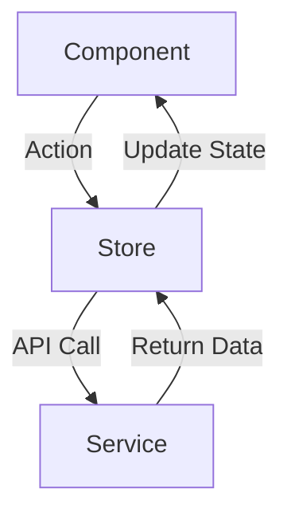

# Nexora | Module 3 — Tasks & Kanban

## 1. Module Purpose
This module manages the Kanban board and tasks for the Nexora SaaS platform. It demonstrates a standalone React+Vite application upgraded from a feature folder.

## 2. Features
- Standalone React + Vite architecture.
- Full drag-and-drop Kanban board using HTML5 native DnD API (no external libraries).
- Role-based Access Control (RBAC) ready mock schema.
- Optimistic UI updates with rollback capabilities.

## 3. Folder Structure
- `src/mock/tasks.js`: Upgraded schema mirroring Nexora Task model with MongoDB style `_id`, RBAC roles, and metadata.
- `src/services/taskService.js`: Service layer for fetching tasks and mutating them (simulated API delay).
- `src/store/taskStore.js`: Zustand store for state management containing optimistic updates and socket.io handler stubs.
- `src/index.css`: Global styles including Tailwind configuration and custom CSS variables.
- `src/App.jsx`: Routing configuration entry point.
- `src/main.jsx`: Application bootstrap file.

## 4. How to Run
```bash
npm install
npm run dev
```
Runs locally at `http://localhost:5175`.

## 5. Data Flow Diagram


## 6. Task Schema
The mock data relies on:
- `_id`: MongoDB style ID.
- `__v`: Optimistic concurrency control (version).
- `projectRole`: Contained in the `assignee` object for frontend RBAC checks.

## 7. RBAC Table
| Role            | Permissions                                      |
|-----------------|--------------------------------------------------|
| project_manager | Full control (create, update, delete, assign)    |
| developer       | Can update status of own tasks, create tasks     |
| designer        | Can update status of design tasks, create tasks  |
| qa              | Can mark tasks done, update status, comment      |

## 8. Drag and Drop
Built exclusively with HTML5 native Drag and Drop (`onDragStart`, `onDragOver`, `onDrop`), ensuring better performance and avoiding heavy third-party dependencies.

## 9. Optimistic Updates
The Zustand store immediately updates the local UI state on task moves. If the subsequent service call fails, the store seamlessly rolls back the state to its previous version, keeping UI and data consistent.

## 10. Future API Integration
Prepared stubs for REST API connections in `taskService.js` and placeholder functions in `taskStore.js` (`socketUpdateTask`, `socketAddTask`, `socketDeleteTask`) for real-time Socket.io integration.
